# 📖 Manual de Usuario - Gestión de Gastos TDS

Este documento guía al usuario a través de las funcionalidades de la aplicación, desde el acceso inicial hasta la gestión avanzada de finanzas personales y grupales.

---

## 1. Menú de Inicio y Selección de Cuenta

Al ejecutar la aplicación, se presenta una pantalla de bienvenida donde el usuario debe elegir el entorno de trabajo según sus necesidades. La interfaz está dividida en dos grandes bloques:

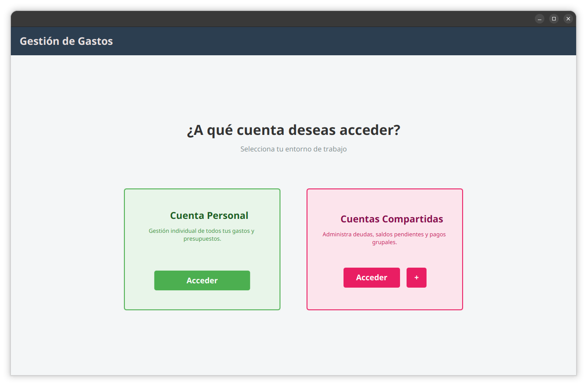

### 1.1 Cuenta Personal
Es el entorno diseñado para la **gestión individual**. 
* Permite llevar un control exhaustivo de todos tus gastos personales.
* Permite definir presupuestos y límites de ahorro propios.
* **Cómo acceder**: Haga clic en el botón verde **"Acceder"** dentro del cuadro de Cuenta Personal.

### 1.2 Cuentas Compartidas
Este entorno está enfocado en la **gestión grupal** (pisos compartidos, viajes con amigos, parejas, etc.). Permite administrar deudas, saldos pendientes y pagos grupales de forma equitativa.

#### A. Selección de una cuenta existente
Al hacer clic en el botón rosa **"Acceder"**, se desplegará una ventana emergente con el listado de sus grupos actuales.

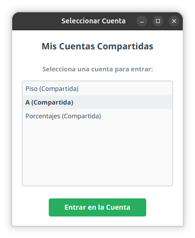

* **Listado de Cuentas**: Podrá visualizar todas las cuentas en las que participa (ej. "Piso", "A", "Porcentajes").
* **Acceso**: Seleccione la cuenta deseada de la lista y pulse el botón verde **"Entrar en la Cuenta"** para cargar su panel de gestión específico.

#### B. Creación de una nueva cuenta
Si desea iniciar la gestión de un nuevo grupo, debe utilizar el botón **"+"** situado junto al botón de acceder en el menú principal.

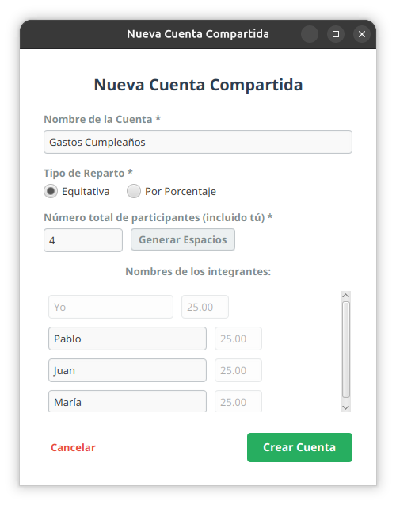

* **Configuración Inicial**: Se abrirá un asistente donde podrá definir el nombre del grupo y añadir a los participantes.
* **Asignación de Responsabilidades**: Durante la creación, podrá establecer qué porcentaje de los gastos totales asume cada miembro, asegurando que el balance de deudas sea exacto y justo para todos los integrantes.

---

## 2. Dashboard de Mi Cuenta Personal (Detalle)

Una vez dentro de la **Cuenta Personal**, el sistema ofrece herramientas avanzadas para el control de los gastos individuales.

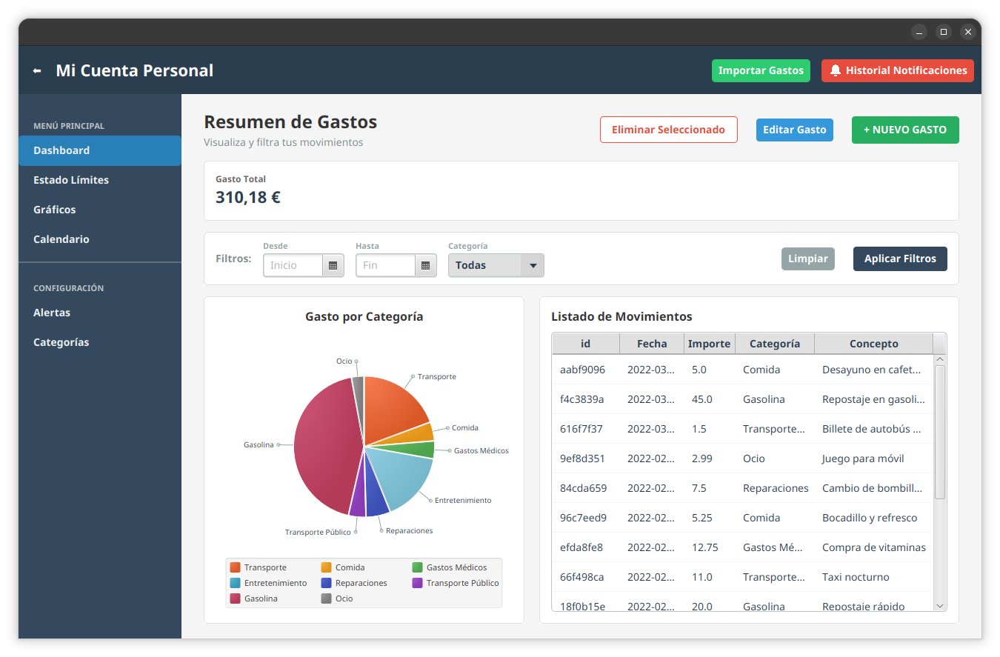

### 2.1 Registro de Nuevos Gastos
Para mantener sus finanzas al día, el usuario puede registrar movimientos manualmente mediante un formulario intuitivo.

* **Acceso**: Haga clic en el botón verde **"+ NUEVO GASTO"**.
* **Campos Obligatorios**: Es necesario introducir el **Importe (€)**, una **Descripción** corta, la **Fecha** del movimiento y seleccionar una **Categoría**.
* **Categorías Rápidas**: Si la categoría deseada no existe, puede crear una nueva directamente pulsando el botón **"+"** junto al desplegable.

### 2.2 Control Visual por Categorías
El Dashboard incluye un gráfico circular interactivo que permite analizar de un vistazo en qué conceptos se está invirtiendo el dinero.

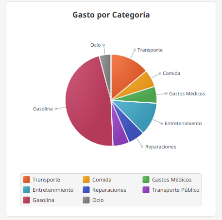

* **Distribución porcentual**: Cada color representa una categoría diferente (Gasolina, Comida, Entretenimiento, etc.).
* **Leyenda interactiva**: Situada en la parte inferior para facilitar la identificación de cada segmento.

### 2.3 Listado y Edición de Movimientos
Todos los gastos se registran en una tabla detallada que permite la gestión posterior de los datos.

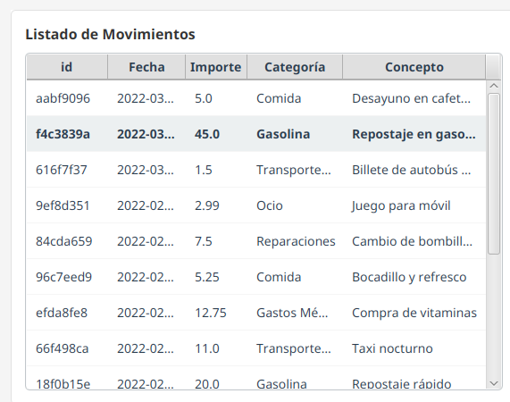

* **Identificación**: Cada gasto posee un ID único para asegurar su trazabilidad.
* **Acciones**: Al seleccionar un movimiento de la tabla, se habilitan los botones para **Editar Gasto** (cambiar importe o concepto) o **Eliminar Seleccionado** para corregir errores.

### 2.4 Filtrado Avanzado
Para facilitar la búsqueda de gastos específicos o analizar periodos concretos, el usuario dispone de una barra de filtros en la parte superior del Dashboard.

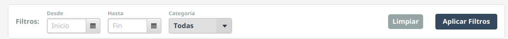

* **Rango de Fechas**: Permite establecer una fecha de **"Desde"** e **"Hasta"**.
* **Filtro por Categoría**: Opción para visualizar solo los gastos de un tipo específico (ej. ver solo cuánto se ha gastado en "Gasolina").
* **Uso**: Una vez configurados, pulse **"Aplicar Filtros"** para actualizar la vista o **"Limpiar"** para volver a la vista general.

### 2.5 Historial de Notificaciones y Gestión de Alertas

El sistema de notificaciones es la herramienta de comunicación entre el motor de control de límites de la aplicación y el usuario. Cada vez que se detecta un gasto que supera un presupuesto establecido, se registra una entrada en este historial.

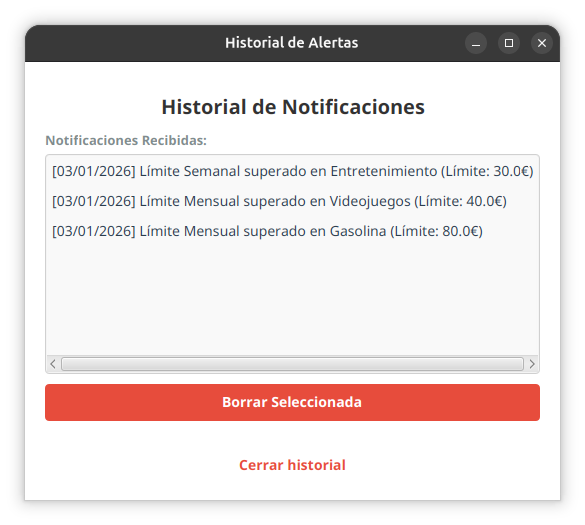

**Acceso Directo**: Puede abrir esta ventana en cualquier momento haciendo clic en el botón rojo **"Historial Notificaciones"** situado en la barra superior de la aplicación.

### 2.6 Importación Masiva de Gastos (Recurso Externo)
Para facilitar la carga de datos sin necesidad de introducirlos uno a uno, la aplicación permite la importación de movimientos mediante archivos de texto plano en formato `.csv`.

#### Descarga del Recurso de Ejemplo
Para asegurar que los datos se cargan correctamente, se recomienda utilizar como base el archivo de ejemplo disponible en los recursos del proyecto:
* 📥 **Descargar aquí**: [EjemploDatosGasto.csv](./formatosImportar/EjemploDatosGasto.csv)

#### Pasos para Importar:
1. Pulse el botón verde **"Importar Gastos"** en la barra de herramientas superior.
2. Seleccione el archivo `.csv` desde su explorador de archivos.
3. El sistema validará los datos y, si el formato es correcto, los movimientos aparecerán automáticamente en su **Listado de Movimientos** y se verán reflejados en todos los gráficos del Dashboard.

---

## 3. Herramientas de Análisis (Menú Lateral)

Además del Dashboard, la aplicación ofrece herramientas profundas para entender el comportamiento de sus gastos y personalizar sus preferencias.

### 3.1 Monitorización de Límites (Semáforo de Gasto)

La sección de **Estado Límites** es la herramienta más potente para el control financiero preventivo. Utiliza un código de colores basado en el porcentaje de gasto realizado respecto al límite establecido en una categoría.

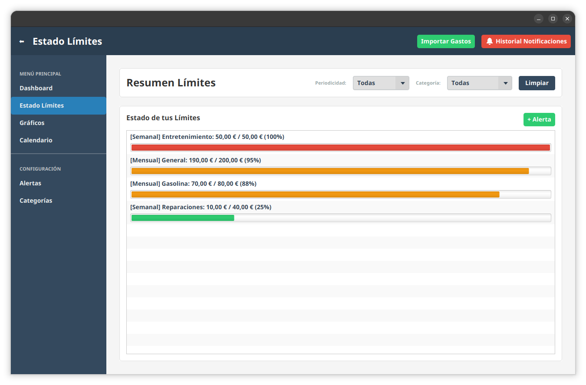

Cada tarjeta de límite muestra:
* El **Nombre de la Categoría** afectada.
* La **Periodicidad** (Semanal o Mensual).
* El **Importe Actual** consumido frente al **Importe Máximo** permitido.

### 3.2 Análisis y Estadísticas
La sección de **Gráficos** permite una auditoría visual de su economía a lo largo del tiempo.

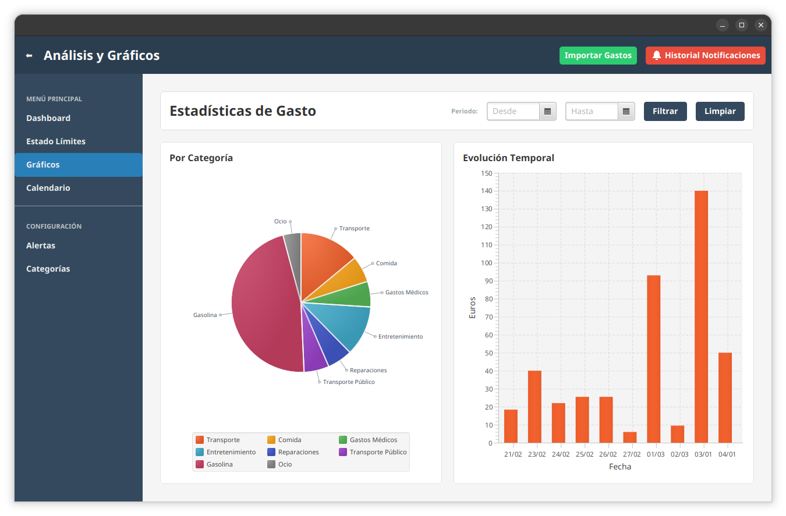

* **Evolución Temporal**: Un gráfico de barras muestra la progresión diaria de los gastos, permitiendo identificar picos de consumo en fechas concretas.
* **Comparativa por Categoría**: Reutiliza el gráfico sectorial para comparar el peso de cada categoría dentro del periodo filtrado.
* **Filtros de Análisis**: Puede acotar este análisis usando los selectores de fecha superiores para comparar, por ejemplo, el gasto de esta semana frente a la anterior.

### 3.3 Vista de Calendario
Para una comprensión cronológica, la vista de **Calendario** posiciona cada gasto en el día exacto en que se produjo.

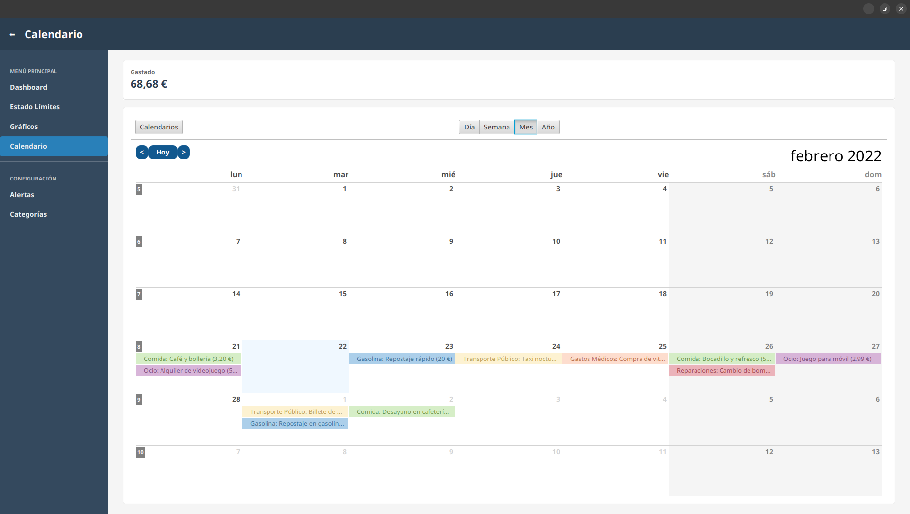

* **Resumen Diario**: Cada celda del calendario muestra los conceptos y el importe gastado ese día.
* **Navegación**: Permite cambiar entre meses y años, ofreciendo un histórico visual rápido de su actividad financiera.

## 4. Configuraciones

### 4.1 Gestión de Alertas
Esta es la herramienta preventiva de la aplicación, diseñada para evitar que el usuario supere sus presupuestos en una categoría.

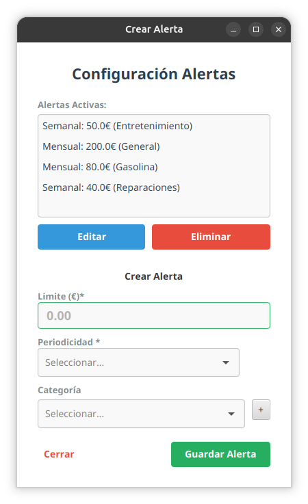

* **Alertas Activas**: Listado de todos los límites establecidos actualmente (ej. "Mensual: 200.0€ General").
* **Crear Nueva Alerta**: 
    1. Introduzca el **Límite (€)** máximo deseado.
    2. Seleccione la **Periodicidad** (Semanal o Mensual).
    3. Elija una **Categoría** específica o "General" para toda la cuenta.
* **Gestión**: Desde esta ventana puede **Editar** límites existentes o **Eliminar** aquellos que ya no necesite.

### 4.2 Gestión de Categorías Personalizadas
La aplicación es totalmente flexible, permitiendo al usuario definir sus propias etiquetas de gasto.

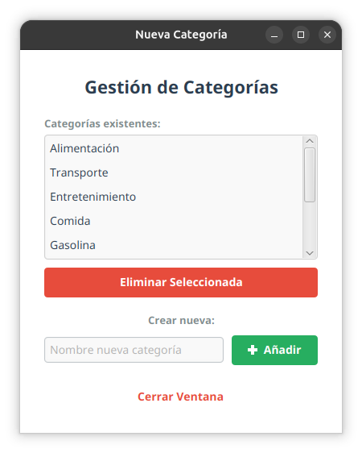

* **Personalización**: Si las categorías por defecto no son suficientes, puede añadir nuevas mediante el campo **"Crear nueva"**.
* **Mantenimiento**: Permite **Eliminar Seleccionada** para mantener el listado limpio y adaptado a sus necesidades reales de clasificación.

---

## 5. Cuentas Compartidas 

Tras navegar por la interfaz de una Cuenta Personal, nos adentro al de una **Cuenta Compartida**, la aplicación activa herramientas específicas diseñadas para garantizar la equidad financiera y el control de deudas dentro de un grupo.

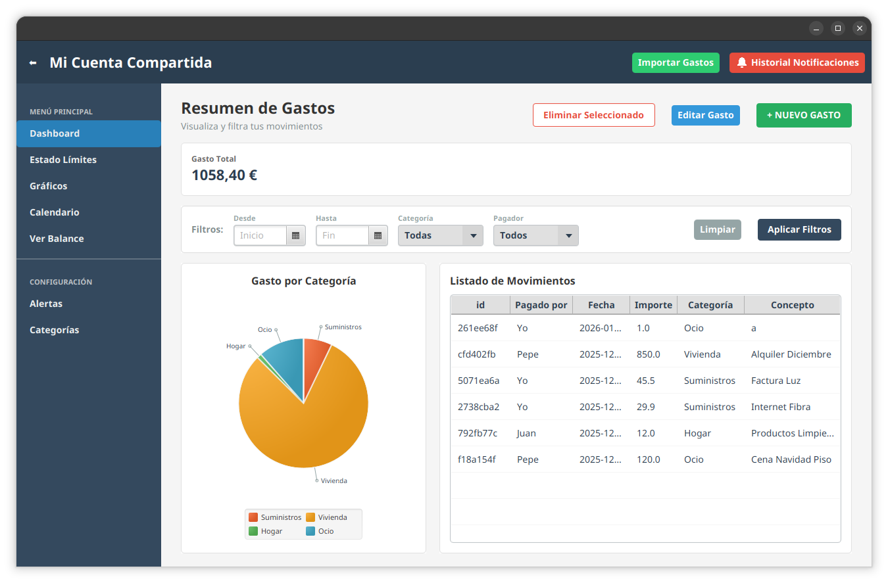

### 5.1 Dashboard Grupal y Listado
El panel de control compartido mantiene la misma estructura que el personal, pero añade una columna vital en el **Listado de Movimientos**:
* **Columna "Pagado por"**: Identifica claramente qué miembro del grupo realizó el desembolso inicial.
* **Filtro por Pagador**: Permite filtrar la tabla para ver exclusivamente los gastos abonados por un integrante específico.

### 5.2 Registro de Gastos Compartidos
El proceso de añadir un movimiento es idéntico al de la cuenta personal, con una adición fundamental para el cálculo de deudas.

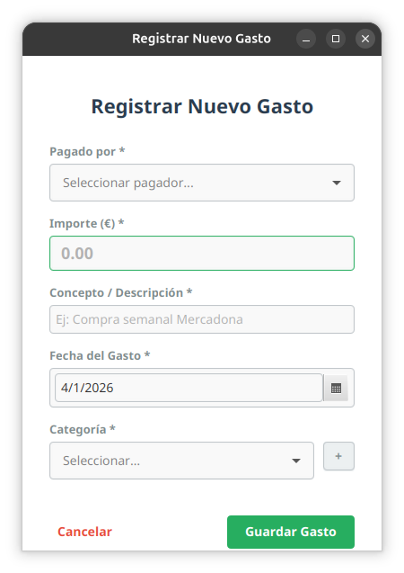

* **Selección de Pagador**: Al registrar el gasto, se debe indicar quién lo ha pagado. 
* **División Automática**: El sistema toma el importe total y lo reparte automáticamente entre todos los participantes según los porcentajes de responsabilidad definidos al crear la cuenta.
* **Actualización en Tiempo Real**: Al guardar el gasto, los saldos individuales de todos los miembros se actualizan instantáneamente en el balance.

### 5.3 Balance de Situación y Liquidación
La herramienta clave de esta sección es la ventana de **Balance**, accesible mediante el botón correspondiente en el menú lateral.

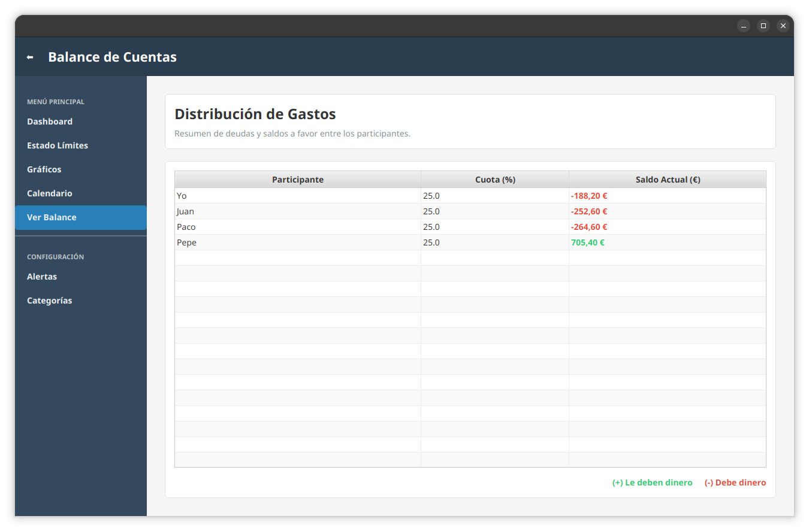

* **Gestión de Participantes**: La ventana muestra a todos los integrantes del grupo junto a su porcentaje de asunción de gastos (ej. 50%, 25%, etc.).
* **Interpretación del Saldo**:
    * **(+) Positivo (Verde)**: Indica que el grupo le debe dinero a ese participante. Ocurre cuando sus pagos realizados superan lo que le corresponde pagar por contrato.
    * **(-) Negativo (Rojo)**: Indica que el participante debe dinero al grupo. Debe realizar una aportación para equilibrar sus gastos pendientes.

---

*Fin del Manual de Usuario.*

